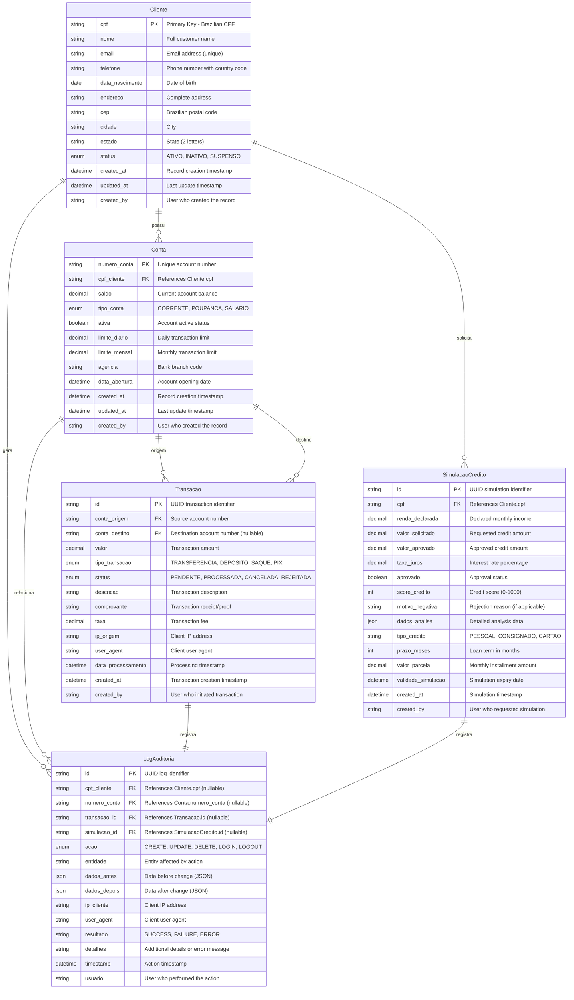

# API de Demonstração Bancária - Diagrama de Relacionamento de Entidades

Este documento descreve o modelo de dados completo para a API de Demonstração Bancária, mostrando todas as entidades, seus atributos e relacionamentos. O ERD foi projetado para suportar operações bancárias típicas mantendo simplicidade para fins de demonstração.

## Implementações Suportadas

Este modelo de dados é compatível com:
- **Python + FastAPI + SQLAlchemy**
- **Node.js + Express + SQLite3**

## Visão Geral

O modelo de dados do sistema bancário suporta:
- Gestão de clientes com validação de documentos brasileiros
- Múltiplos tipos de conta por cliente
- Processamento de transações com trilha de auditoria completa
- Simulação e scoring de crédito
- Capacidades abrangentes de logging e auditoria

## Estruturas SQLite para Node.js

### Schema SQL para Implementação Node.js
```sql
-- Tabela de Clientes
CREATE TABLE clientes (
    cpf TEXT PRIMARY KEY,
    nome TEXT NOT NULL,
    email TEXT UNIQUE,
    telefone TEXT,
    data_nascimento DATE NOT NULL,
    endereco TEXT,
    cep TEXT,
    cidade TEXT,
    estado TEXT,
    status TEXT DEFAULT 'ATIVO' CHECK (status IN ('ATIVO', 'INATIVO', 'SUSPENSO')),
    created_at DATETIME DEFAULT CURRENT_TIMESTAMP,
    updated_at DATETIME DEFAULT CURRENT_TIMESTAMP
);

-- Tabela de Contas
CREATE TABLE contas (
    numero_conta TEXT PRIMARY KEY,
    cpf_cliente TEXT NOT NULL,
    saldo DECIMAL(15,2) DEFAULT 0.00,
    tipo_conta TEXT NOT NULL CHECK (tipo_conta IN ('corrente', 'poupanca')),
    ativa BOOLEAN DEFAULT TRUE,
    limite_diario DECIMAL(15,2) DEFAULT 5000.00,
    agencia TEXT DEFAULT '0001',
    created_at DATETIME DEFAULT CURRENT_TIMESTAMP,
    updated_at DATETIME DEFAULT CURRENT_TIMESTAMP,
    FOREIGN KEY (cpf_cliente) REFERENCES clientes(cpf)
);

-- Índices para Performance
CREATE INDEX idx_clientes_email ON clientes(email);
CREATE INDEX idx_contas_cliente ON contas(cpf_cliente);
CREATE INDEX idx_contas_ativa ON contas(ativa);
```

### Models Node.js (Padrão Repository)
```javascript
// models/Cliente.js
class Cliente {
    static async criar(dadosCliente) {
        const { cpf, nome, email, telefone, data_nascimento } = dadosCliente;
        const query = `
            INSERT INTO clientes (cpf, nome, email, telefone, data_nascimento)
            VALUES (?, ?, ?, ?, ?)
        `;
        return db.run(query, [cpf, nome, email, telefone, data_nascimento]);
    }
    
    static async buscarPorCpf(cpf) {
        const query = 'SELECT * FROM clientes WHERE cpf = ?';
        return db.get(query, [cpf]);
    }
    
    static async atualizar(cpf, dados) {
        const campos = Object.keys(dados);
        const valores = Object.values(dados);
        const placeholders = campos.map(campo => `${campo} = ?`).join(', ');
        
        const query = `
            UPDATE clientes 
            SET ${placeholders}, updated_at = CURRENT_TIMESTAMP
            WHERE cpf = ?
        `;
        return db.run(query, [...valores, cpf]);
    }
    
    static async listar() {
        const query = 'SELECT * FROM clientes ORDER BY nome';
        return db.all(query);
    }
}

// models/Conta.js
class Conta {
    static async criar(dadosConta) {
        const { numero_conta, cpf_cliente, tipo_conta, saldo_inicial = 0.00 } = dadosConta;
        const query = `
            INSERT INTO contas (numero_conta, cpf_cliente, tipo_conta, saldo)
            VALUES (?, ?, ?, ?)
        `;
        return db.run(query, [numero_conta, cpf_cliente, tipo_conta, saldo_inicial]);
    }
    
    static async buscarPorNumero(numero_conta) {
        const query = 'SELECT * FROM contas WHERE numero_conta = ? AND ativa = 1';
        return db.get(query, [numero_conta]);
    }
    
    static async listarPorCliente(cpf_cliente) {
        const query = 'SELECT * FROM contas WHERE cpf_cliente = ? AND ativa = 1';
        return db.all(query, [cpf_cliente]);
    }
    
    static async atualizarSaldo(numero_conta, novoSaldo) {
        const query = `
            UPDATE contas 
            SET saldo = ?, updated_at = CURRENT_TIMESTAMP
            WHERE numero_conta = ?
        `;
        return db.run(query, [novoSaldo, numero_conta]);
    }
}
```

## Entity Relationship Diagram



## Descrições das Entidades

### Cliente (Customer)
A entidade central representando clientes do banco. Armazena informações pessoais necessárias para compliance KYC (Conheça Seu Cliente) e regulamentações bancárias brasileiras.

**Principais Funcionalidades:**
- Validação de CPF brasileiro com dígitos verificadores
- Informações completas de endereço para compliance
- Rastreamento de status para gestão de conta
- Trilha de auditoria para todas as mudanças

### Conta (Account)
Representa contas bancárias pertencentes aos clientes. Suporta múltiplos tipos de conta e inclui limites de transação para segurança.

**Principais Funcionalidades:**
- Múltiplas contas por cliente
- Limites de transação diários e mensais
- Associação com agência para banking físico
- Gestão de status da conta

### Transacao (Transaction)
Registra todas as transações financeiras com informações abrangentes de auditoria para compliance e detecção de fraude.

**Principais Funcionalidades:**
- Suporte para vários tipos de transação incluindo PIX
- Trilha de auditoria completa com IP e user agent
- Rastreamento de taxas de transação
- Gestão de workflow de status

### SimulacaoCredito (Credit Simulation)
Manipula análise de crédito e processos de pré-aprovação com scoring detalhado e dados de análise.

**Principais Funcionalidades:**
- Múltiplos tipos de produtos de crédito
- Scoring de crédito detalhado (escala 0-1000)
- Armazenamento de resultado de análise para compliance

## Validações e Constraints Obrigatórias

### Validação de CPF (CRÍTICA)
```javascript
// utils/cpfValidator.js
const validarCPF = (cpf) => {
    const cpfLimpo = cpf.replace(/[^\d]/g, '');
    
    if (cpfLimpo.length !== 11) return false;
    if (/^(\d)\1{10}$/.test(cpfLimpo)) return false;
    
    // Validação do primeiro dígito verificador
    let soma = 0;
    for (let i = 0; i < 9; i++) {
        soma += parseInt(cpfLimpo.charAt(i)) * (10 - i);
    }
    let primeiroDigito = 11 - (soma % 11);
    if (primeiroDigito >= 10) primeiroDigito = 0;
    if (parseInt(cpfLimpo.charAt(9)) !== primeiroDigito) return false;
    
    // Validação do segundo dígito verificador
    soma = 0;
    for (let i = 0; i < 10; i++) {
        soma += parseInt(cpfLimpo.charAt(i)) * (11 - i);
    }
    let segundoDigito = 11 - (soma % 11);
    if (segundoDigito >= 10) segundoDigito = 0;
    
    return parseInt(cpfLimpo.charAt(10)) === segundoDigito;
};
```

### Constraints de Banco de Dados
```sql
-- Constraints obrigatórias para integridade
ALTER TABLE clientes ADD CONSTRAINT check_cpf_length 
    CHECK (length(replace(cpf, '.', '')) = 11);

ALTER TABLE contas ADD CONSTRAINT check_saldo_positivo 
    CHECK (saldo >= 0);

ALTER TABLE contas ADD CONSTRAINT check_tipo_conta_valido 
    CHECK (tipo_conta IN ('corrente', 'poupanca'));

-- Triggers para updated_at automático
CREATE TRIGGER atualizar_cliente_timestamp 
    AFTER UPDATE ON clientes
    FOR EACH ROW
    BEGIN
        UPDATE clientes SET updated_at = CURRENT_TIMESTAMP WHERE cpf = NEW.cpf;
    END;

CREATE TRIGGER atualizar_conta_timestamp 
    AFTER UPDATE ON contas
    FOR EACH ROW
    BEGIN
        UPDATE contas SET updated_at = CURRENT_TIMESTAMP WHERE numero_conta = NEW.numero_conta;
    END;
```

### Padrões de Dados Brasileiros
```javascript
// Formatos obrigatórios para dados brasileiros
const formatarCPF = (cpf) => {
    const cpfLimpo = cpf.replace(/[^\d]/g, '');
    return cpfLimpo.replace(/(\d{3})(\d{3})(\d{3})(\d{2})/, '$1.$2.$3-$4');
};

const validarTelefone = (telefone) => {
    // Aceita formatos: (11) 99999-9999, 11999999999, +5511999999999
    const regex = /^(\+55)?(\d{2})(\d{4,5})(\d{4})$/;
    return regex.test(telefone.replace(/[^\d+]/g, ''));
};

const validarCEP = (cep) => {
    // Formato brasileiro: 12345-678 ou 12345678
    const regex = /^(\d{5})-?(\d{3})$/;
    return regex.test(cep);
};
```

## Problemas Comuns e Soluções de Banco de Dados

### ❌ Erros Frequentes

#### 1. CPF Inválido ou Mal Formatado
**Problema**: Inserção de CPFs sem validação
**Solução**: SEMPRE validar CPF antes de inserir no banco
```javascript
// ❌ ERRADO
await Cliente.criar({ cpf: '12345678901', nome: 'João' });

// ✅ CORRETO
if (!validarCPF(dadosCliente.cpf)) {
    throw new Error('CPF inválido');
}
const cpfLimpo = dadosCliente.cpf.replace(/[^\d]/g, '');
await Cliente.criar({ ...dadosCliente, cpf: cpfLimpo });
```

#### 2. Números de Conta Duplicados
**Problema**: Geração manual de números pode criar duplicatas
**Solução**: Usar função que verifica unicidade
```javascript
static async gerarNumeroConta() {
    let numero;
    let existe = true;
    
    while (existe) {
        numero = Math.floor(100000 + Math.random() * 900000).toString();
        const conta = await this.buscarPorNumero(numero);
        existe = !!conta;
    }
    
    return numero;
}
```

#### 3. Operações Sem Transação
**Problema**: Operações críticas sem transação de banco
**Solução**: Sempre usar transações para operações relacionadas
```javascript
// ✅ CORRETO - Usar transação para operações críticas
static async transferir(contaOrigem, contaDestino, valor) {
    const db = await database.getConnection();
    
    try {
        await db.run('BEGIN TRANSACTION');
        
        // Debitar da conta origem
        await db.run(
            'UPDATE contas SET saldo = saldo - ? WHERE numero_conta = ?',
            [valor, contaOrigem]
        );
        
        // Creditar na conta destino
        await db.run(
            'UPDATE contas SET saldo = saldo + ? WHERE numero_conta = ?',
            [valor, contaDestino]
        );
        
        await db.run('COMMIT');
    } catch (error) {
        await db.run('ROLLBACK');
        throw error;
    }
}
```

### ✅ Boas Práticas de Implementação

1. **Sempre validar CPF** antes de qualquer operação
2. **Usar transações** para operações críticas
3. **Implementar constraints** no nível de banco de dados
4. **Gerar números únicos** com verificação de duplicata
5. **Formatar dados** antes de armazenar
6. **Implementar logs** para todas as operações
7. **Verificar relacionamentos** antes de deletar registros
- Validade limitada por tempo da simulação

### LogAuditoria (Audit Log)
Logging de auditoria abrangente para compliance com regulamentações bancárias e investigação de fraude.

**Principais Funcionalidades:**
- Links para todas as entidades principais
- Rastreamento de dados antes/depois
- Informações completas de sessão do usuário
- Logging detalhado de erros e sucessos

## Relacionamentos

### Relacionamentos Um-para-Muitos
- **Cliente → Conta**: Um cliente pode ter múltiplas contas
- **Cliente → SimulacaoCredito**: Um cliente pode ter múltiplas simulações de crédito
- **Conta → Transacao**: Uma conta pode ser origem de múltiplas transações

### Relacionamentos Muitos-para-Um
- **Transacao → Conta**: Múltiplas transações podem ter como destino a mesma conta
- **LogAuditoria → [Todas as Entidades]**: Múltiplos logs de auditoria por entidade para rastreamento completo

## Tipos de Dados e Restrições

### Validações Específicas Brasileiras
- **CPF**: Formato de 11 dígitos com validação de dígito verificador
- **CEP**: Formato de código postal de 8 dígitos (XXXXX-XXX)
- **Telefone**: Formato de telefone brasileiro com código do país (+55)
- **Estado**: Códigos de estado de duas letras (SP, RJ, MG, etc.)

### Restrições Financeiras
- **Precisão Decimal**: Todos os valores monetários usam DECIMAL(15,2)
- **Valores Positivos**: Valores de transação devem ser positivos
- **Regras de Saldo**: Saldo da conta não pode ficar abaixo dos limites definidos
- **Limites de Taxa**: Limites de transação diários/mensais aplicados

### Requisitos de Auditoria
- **Logs Imutáveis**: Logs de auditoria não podem ser modificados uma vez criados
- **Rastreamento Completo**: Todas as mudanças de entidade devem gerar logs de auditoria
- **Política de Retenção**: Logs retidos por mínimo de 5 anos (requisito regulatório)

## Indexes and Performance

### Primary Indexes
- All primary keys have clustered indexes
- Foreign key relationships have non-clustered indexes

### Query Optimization Indexes
- `Cliente.email` - Unique index for login operations
- `Conta.cpf_cliente` - Index for customer account lookups
- `Transacao.conta_origem, data_processamento` - Composite index for transaction history
- `LogAuditoria.timestamp, entidade` - Composite index for audit queries

### Performance Considerations
- Partitioning strategy for large transaction tables
- Archive strategy for old audit logs
- Connection pooling for concurrent operations

## Segurança e Compliance

### Proteção de Dados
- Criptografia de dados PII em repouso
- Mascaramento de campos sensíveis em logs
- Gerenciamento seguro de chaves para criptografia

### Compliance Regulatório
- **LGPD**: Compliance com lei de proteção de dados brasileira
- **BACEN**: Regulamentações do Banco Central do Brasil
- **Sigilo Bancário**: Requisitos de proteção de dados do cliente

### Requisitos de Auditoria
- Trilha completa de transações
- Logging de ações do usuário
- Rastreamento de modificações de dados
- Capacidades de relatórios de compliance

---
