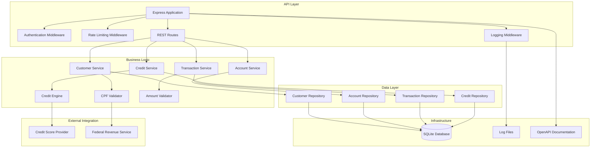

# Arquitetura da API de Demonstração Bancária

Esta aplicação é um sistema bancário de demonstração desenvolvido em **Node.js usando Express**. Toda a aplicação foi criada para demonstrar as capacidades do GitHub Copilot no contexto bancário, apresentando funcionalidades como gestão de clientes, operações de conta e simulação de crédito. O sistema foi construído usando prompts em linguagem natural e agentes do Copilot para demonstrar workflows de desenvolvimento assistido por IA.

O modelo de dados completo e os relacionamentos entre entidades estão documentados no [diagrama ERD](./ERD.md).

## Implementação Atual

### Node.js + Express
- Framework Express.js
- SQLite3 nativo
- Validação com Joi
- Logging com Winston
- Arquitetura MVC com camada de serviços

## Visão Geral da Arquitetura

O sistema é uma API bancária moderna construída usando Node.js e Express, projetada para demonstrar operações bancárias seguras e escaláveis, ao mesmo tempo que apresenta as capacidades do GitHub Copilot no desenvolvimento de software financeiro. Segue as melhores práticas da indústria bancária com logging abrangente, validação e medidas de segurança.

### Arquitetura do Backend
- Framework Express.js com arquitetura MVC
- Persistência SQLite3 nativo com padrão de camadas
- Validação Joi para entrada de dados e schemas
- Logging estruturado com Winston para rastreamento de transações
- Middleware de segurança com Helmet e rate limiting
- Validação de entrada com formatos de documentos brasileiros (CPF/CNPJ)
- Tratamento abrangente de erros e exceções customizadas

### Segurança e Compliance
- Sanitização e validação de entrada
- Rate limiting para endpoints da API
- Logging de auditoria estruturado
- Verificações básicas de compliance PLD (Prevenção à Lavagem de Dinheiro)
- Hash seguro de senhas e gerenciamento de token JWT

### Integração DevOps
- Containerização Docker para deployment consistente
- Suite de testes pytest com capacidades de mocking
- Pipeline CI/CD GitHub Actions
- Documentação OpenAPI/Swagger
- Endpoints de health check para monitoramento

## Component Architecture



## Componentes Frontend (Interface de Demonstração)

### Dashboard Web
Um dashboard HTML5/JavaScript simples que fornece uma interface visual para a API bancária, usado principalmente para fins de demonstração.

#### Componentes:
- **Painel de Gestão de Clientes**: Formulários para criar e gerenciar clientes
- **Operações de Conta**: Interface para criação de contas e gestão de saldo
- **Dashboard de Transações**: Monitoramento e histórico de transações em tempo real
- **Simulação de Crédito**: Workflow interativo de solicitação e aprovação de crédito

#### Stack Tecnológico:
- **HTML5** com markup semântico
- **JavaScript Vanilla** (ES6+) para consumo da API
- **CSS3** com Flexbox/Grid para design responsivo
- **Chart.js** para visualização de dados
- **Bootstrap 5** para desenvolvimento rápido de UI

#### API Integration:
```javascript
// API Client Configuration
const API_BASE_URL = 'http://localhost:8000';
const apiClient = {
  headers: {
    'Content-Type': 'application/json',
    'Authorization': 'Bearer ' + localStorage.getItem('token')
  }
};
```

### Funcionalidades do Dashboard

#### 1. Interface de Gestão de Clientes
```html
<!-- Formulário de Cadastro de Cliente -->
<form id="customerForm">
  <input type="text" name="nome" placeholder="Nome completo" required>
  <input type="text" name="cpf" placeholder="CPF" pattern="[0-9]{11}" required>
  <input type="email" name="email" placeholder="Email" required>
  <input type="number" name="renda_mensal" placeholder="Renda mensal" required>
  <button type="submit">Cadastrar Cliente</button>
</form>
```

#### 2. Dashboard em Tempo Real
- **Métricas ao vivo**: Clientes ativos, total de contas, volume de transações
- **Gráficos**: Transações diárias, tendências de saldo de contas, aprovações de crédito
- **Alertas**: Status do sistema, eventos de segurança, violações de regras de negócio

#### 3. Monitor de Transações
- **Atualizações em tempo real** via WebSocket ou polling
- **Filtragem de transações** por data, valor, tipo
- **Funcionalidade de exportação** para relatórios

## Documentação e Testes da API

### Documentação da API
A API possui documentação completa com schemas de request/response e exemplos de uso.

#### Funcionalidades:
- **Schemas de request/response** com exemplos
- **Validação de entrada** com Joi
- **Documentação de modelos** com descrições de campos
- **Collection Postman** para testes

#### Documentação via Collection:
- Collection Postman com todos os endpoints
- Variáveis de ambiente configuradas
- Scripts de teste automatizados
- Dados de exemplo para desenvolvimento

### Collection Postman
Collection Postman pré-configurada com:
- **Todas as configurações de endpoints**
- **Variáveis de ambiente** para diferentes estágios
- **Workflows de autenticação**
- **Scripts de teste** para validação de resposta
- **Dados mock** para testes realistas

#### Estrutura da Collection:
```
API Demonstração Bancária/
├── Autenticação/
│   ├── Login
│   └── Atualizar Token
├── Gestão de Clientes/
│   ├── Criar Cliente
│   ├── Listar Clientes
│   └── Atualizar Cliente
├── Operações de Conta/
│   ├── Criar Conta
│   ├── Consultar Saldo
│   └── Histórico da Conta
├── Transações/
│   ├── Transferir Fundos
│   ├── Depósito
│   └── Histórico de Transações
└── Serviços de Crédito/
    ├── Simular Crédito
    └── Histórico de Crédito
```

## Estrutura de Projeto Node.js

### Estrutura de Pastas
```
src/
├── config/
│   ├── database.js           # Configuração do banco SQLite
│   └── logger.js             # Configuração centralizada do Winston
├── controllers/
│   ├── ClienteController.js  # Controlador de clientes
│   └── ContaController.js    # Controlador de contas
├── middleware/               # SINGULAR - não "middlewares"
│   ├── errorHandler.js       # Tratamento centralizado de erros
│   └── requestLogger.js      # Log de requisições HTTP
├── models/
│   ├── Cliente.js           # Model de cliente com métodos CRUD
│   └── Conta.js             # Model de conta com métodos CRUD
├── routes/
│   ├── clienteRoutes.js     # Rotas de clientes
│   └── contaRoutes.js       # Rotas de contas
├── services/
│   ├── ClienteService.js    # Lógica de negócio - clientes
│   └── ContaService.js      # Lógica de negócio - contas
├── utils/
│   ├── cpfValidator.js      # Validador de CPF brasileiro
│   └── validators.js        # Schemas Joi para validação
└── server.js                # Arquivo principal da aplicação
```

### Convenções de Nomenclatura Críticas
- **middleware/** (singular) - NUNCA usar "middlewares"
- **config/logger.js** - Logger centralizado, não inline
- **Exports consistentes** - sempre module.exports com objeto
- **Imports relativos** - usar caminhos relativos corretos

## Principais Funcionalidades

### Operações Bancárias Centrais
- **Gestão de Clientes**: Cadastro, validação e gerenciamento de perfil
- **Operações de Conta**: Criação de conta, consulta de saldo e gerenciamento de conta
- **Processamento de Transações**: Transferências, depósitos e saques com trilha de auditoria
- **Simulação de Crédito**: Análise de crédito em tempo real com scoring e lógica de aprovação

### Funcionalidades de Segurança e Compliance
- **Validação de Documentos**: Validação de CPF/CNPJ brasileiro com dígitos verificadores
- **Autenticação**: Autenticação baseada em JWT com controle de acesso baseado em funções
- **Logging de Auditoria**: Logging abrangente de transações e operações
- **Rate Limiting**: Proteção da API contra abuso e DDoS
- **Sanitização de Entrada**: Proteção contra ataques de injeção

### Experiência do Desenvolvedor
- **Documentação OpenAPI**: Documentação interativa da API gerada automaticamente
- **Suite de Testes**: Testes unitários e de integração abrangentes com pytest
- **Tratamento de Erros**: Respostas de erro consistentes com códigos de status HTTP adequados
- **Ferramentas de Desenvolvimento**: Hot reload, debugging e capacidades de profiling

## Endpoints da API

### Autenticação
- `POST /auth/login` - Autenticação de usuário
- `POST /auth/refresh` - Atualização de token
- `POST /auth/logout` - Logout de usuário

### Gestão de Clientes
- `POST /customers` - Cadastrar novo cliente
- `GET /customers/{cpf}` - Obter detalhes do cliente
- `PUT /customers/{cpf}` - Atualizar informações do cliente
- `DELETE /customers/{cpf}` - Desativar cliente

### Operações de Conta
- `POST /accounts` - Criar nova conta
- `GET /accounts/{account_number}` - Obter detalhes da conta
- `GET /accounts/{account_number}/balance` - Verificar saldo da conta
- `PUT /accounts/{account_number}/status` - Atualizar status da conta

### Transações
- `POST /transactions/transfer` - Executar transferência de dinheiro
- `POST /transactions/deposit` - Processar depósito
- `POST /transactions/withdrawal` - Processar saque
- `GET /transactions/{account_number}` - Obter histórico de transações

### Serviços de Crédito
- `POST /credit/simulate` - Simular aprovação de crédito
- `GET /credit/history/{cpf}` - Obter histórico de crédito
- `POST /credit/apply` - Submeter solicitação de crédito

## Persistência e Modelo de Dados

- **Banco de Dados**: SQLite com modo WAL para melhor concorrência
- **Driver**: SQLite3 nativo do Node.js
- **Migrações**: Scripts SQL para versionamento de schema
- **Conexões**: Gerenciamento de conexões com pool simples
- **Estratégia de Backup**: Backups diários automatizados com recuperação point-in-time

### Data Storage Structure
```
/data/
├── banking_demo.db          # Main database file
├── banking_demo.db-wal      # Write-ahead log
├── banking_demo.db-shm      # Shared memory file
└── backups/                 # Daily backup storage
    ├── backup_2024_01_01.db
    └── backup_2024_01_02.db
```

## Configuração e Ambiente

### Variáveis de Ambiente
```bash
# Configuração do Banco de Dados
DATABASE_URL=sqlite:///data/banking_demo.db
DB_ECHO=false

# Configuração de Segurança
JWT_SECRET_KEY=your-secret-key-here
JWT_ALGORITHM=HS256
JWT_EXPIRATION_HOURS=24

# Configuração da API
API_HOST=0.0.0.0
API_PORT=8000
API_WORKERS=4

# Configuração de Logging
LOG_LEVEL=INFO
LOG_FORMAT=json
LOG_FILE=/var/log/banking_demo.log

# Rate Limiting
RATE_LIMIT_REQUESTS=100
RATE_LIMIT_WINDOW=60

# Serviços Externos
CREDIT_SCORE_API_URL=https://api.serasa.com.br
FEDERAL_REVENUE_API_URL=https://api.receita.fazenda.gov.br
```

## Workflow de Desenvolvimento

### Integração com GitHub Copilot
Este projeto usa extensivamente as funcionalidades do GitHub Copilot:
- **Geração de Código**: Todos os endpoints e lógica de negócio gerados com Copilot
- **Criação de Testes**: Suites de teste abrangentes criadas usando agentes do Copilot
- **Documentação**: Documentação da API e comentários de código gerados automaticamente
- **Refatoração**: Melhorias de código e otimizações sugeridas pelo Copilot
- **Revisões de Segurança**: Análise de segurança e detecção de vulnerabilidades assistida pelo Copilot

## Development Tools Integration

<!-- ### Testing Strategy
- **Unit Tests**: pytest with 90%+ coverage requirement
- **Integration Tests**: API endpoint testing with test database
- **Frontend Tests**: Playwright for UI automation and E2E testing
- **Security Tests**: Authentication, authorization, and input validation
- **Performance Tests**: Load testing for critical endpoints
- **Compliance Tests**: Regulatory requirement validation

### Test Data Management
- Faker library for generating realistic test data
- Factory pattern for test object creation
- Database fixtures with cleanup between tests
- Mock external services for consistent testing -->

<!-- ### Documentation Generation
- **API Docs**: Auto-generated via FastAPI
- **Code Documentation**: Sphinx with autodoc
- **Architecture Diagrams**: Mermaid integration
- **User Guide**: Markdown with GitHub Pages -->

<!-- ### Development Workflow Tools
- **Hot Reload**: FastAPI development server with auto-restart
- **API Testing**: Swagger UI for interactive testing
- **Collection Management**: Postman for automated API testing
- **Frontend Development**: Live reload for HTML/JS changes -->

## Arquitetura de Deployment

### Desenvolvimento Local
```bash
docker-compose up -d  # Iniciar todos os serviços
npm test              # Executar suite de testes
npm run dev           # Iniciar servidor de desenvolvimento
```

### Deployment de Produção
- **Plataforma de Containers**: Docker com builds multi-estágio
- **Orquestração**: Docker Compose ou Kubernetes
- **Load Balancer**: NGINX com terminação SSL
- **Monitoramento**: Métricas Prometheus com dashboards Grafana
- **Logging**: Logging centralizado com stack ELK


<!-- ## Monitoramento e Observabilidade

### Coleta de Métricas
- Tempos de resposta da API e taxas de erro
- Performance de queries do banco de dados
- Taxas de sucesso/falha de autenticação
- Métricas de negócio (volumes de transação, taxas de aprovação)

### Health Checks
- `/health` - Health check básico
- `/health/detailed` - Status abrangente do sistema
- `/metrics` - Endpoint de métricas Prometheus

### Alertas
- Altas taxas de erro ou tempos de resposta lentos
- Problemas de conexão com banco de dados
- Eventos de segurança (múltiplas tentativas de login falhadas)
- Violações de regras de negócio

## Considerações de Segurança

### Proteção de Dados
- Criptografia de dados sensíveis em repouso
- Mascaramento de dados PII em logs
- Gerenciamento seguro de chaves
- Auditorias de segurança regulares

### Segurança da API
- Rate limiting por cliente/IP
- Limites de tamanho de request
- Prevenção de injeção SQL
- Cabeçalhos de proteção XSS

### Compliance
- Compliance com LGPD (Lei Geral de Proteção de Dados)
- Requisitos de sigilo bancário
- Manutenção de trilha de auditoria
- Políticas de retenção de dados -->

---
